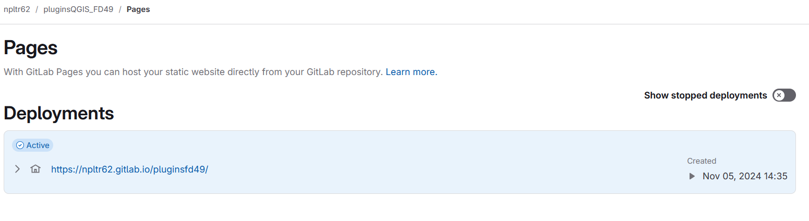

Afin de récupérer ou de saisir des données, il était necessaire de créer quelques outils Python. J'ai donc développé une barre d'outils  Qgis avec plusieurs plugins.

## Création d'un entrepot de plugins

Il était nécessaire de pouvoir versionner et mettre en ligne les plugins, pour cela j'ai créé [un dépôt GitLab](https://gitlab.com/npltr62/pluginsfd49)

### Mise en ligne

- GitLab Pages s’appuie sur un pipeline de CI/CD (Intégration Continue / Déploiement Continu) pour générer et déployer le site.
- Ce pipeline est défini dans le fichier `.gitlab-ci.yml` à la racine du dépôt, où l’on peut spécifier les étapes de génération du site.
- Une fois le pipeline exécuté, les fichiers générés sont déployés pour être accessibles sur GitLab Pages.
- Par convention, les fichiers de sortie qui doivent être publiés sur GitLab Pages doivent être placés dans un dossier nommé **`public`**. Ce dossier est ensuite copié par le pipeline vers le serveur de pages pour être servi au public.
Qgis demande un `.zip` pour être installé

### Dossier public

On y trouve le dossier du plugin compressé `FD49.zip` 
Le fichier cible du dépôt est le fichier `plugins.xml`, il permet à Qgis de lire les informations (nom des plugins, date de mise à jour, détails, tags...).
ensuite le dossier du plugin est au format .zip 